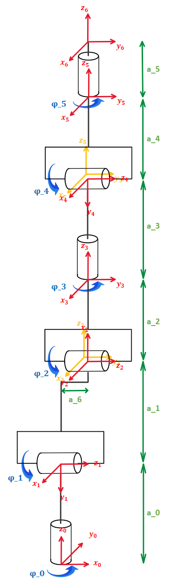
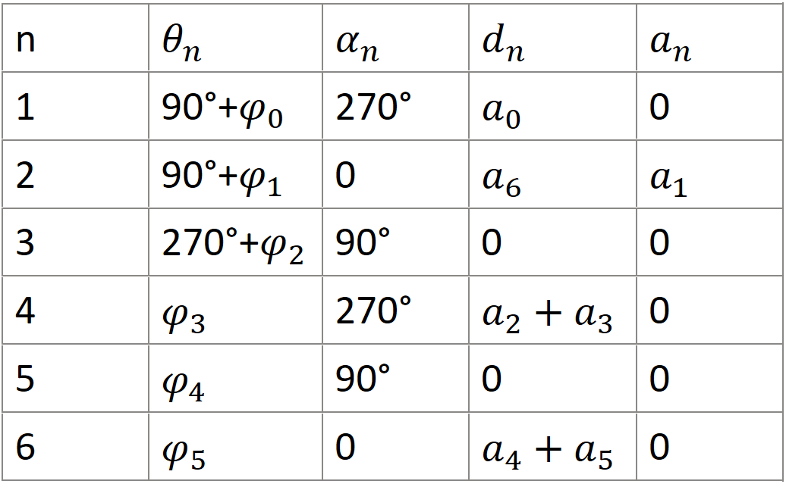
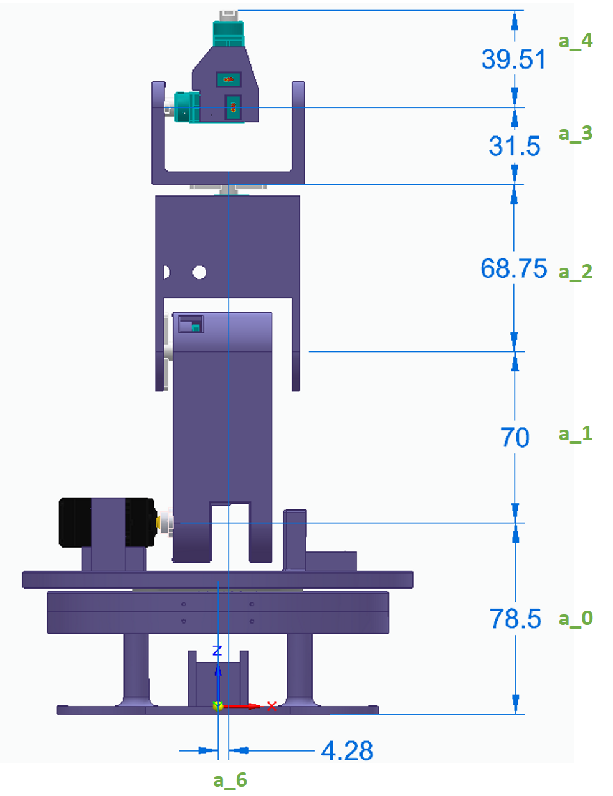

# Denvit-Hartenberg Parameter

Positive Winkeldrehrichtung (wie eingezeichnet) entgegen dem Uhrzeigersinn.

Die konkreten Werte der Streckenparameter sind der nachfogenden Grafik zu entnehmen, wobei **a_5** die Länge einer möglichen, auf Servo_5 aufgsetzten, Spitze oder eines Greifers in z_5-Richtung bezeichnet. Wird kein Aufsatz auf Servo_5 aufgesetzt, so muss **a_5 = 0** gesetzt werden. Längenangaben der Grafik in Millimeter.

