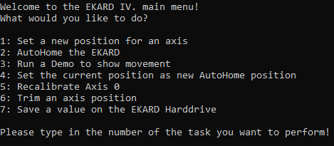
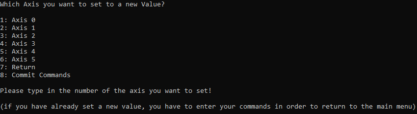
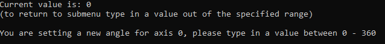
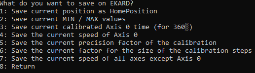
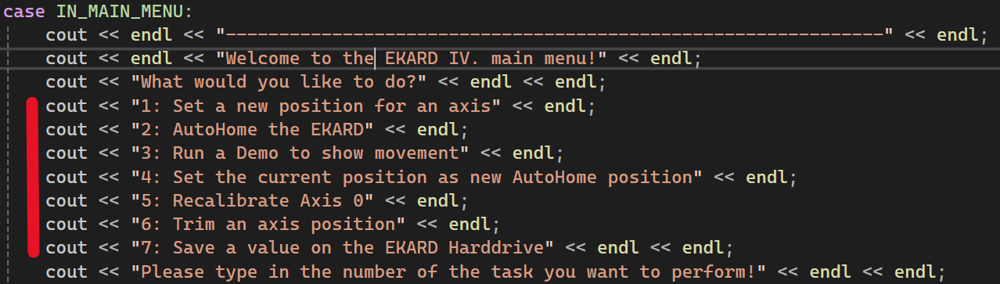
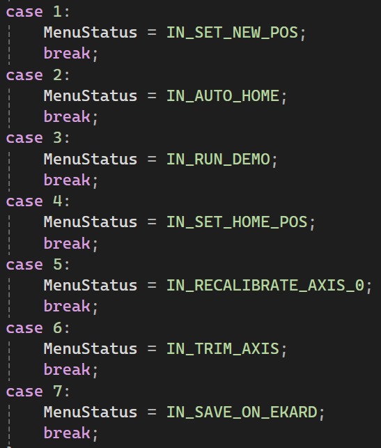

# Client-Interface

## Client-User-Interface

### New Axis Position:
- lässt einen die aktuellen Achsenpositionen des EKARD einzeln beeinflussen

- wird eine Achse angewählt, kann im Untermenü der Achsenwinkel beliebig oft verändert werden. Um das Untermenü wieder zu verlassen, muss ein Zahlenwert außerhalb des erlaubten Inputs eingegeben werden. Die mögliche Input-Spanne wird dabei angegeben.

- um die eingegeben Achsenwerte an den Server zu übermitteln und somit den EKARD in die vorgegebene Position zu bringen, ist Punkt 8 anzuwählen
- um das Untermenü zu verlassen, ohne die Positionswerte an den EKARD zu übermitteln, ist Punkt 7 anzuwählen

### AutoHome:
- lässt den EKARD in die eingespeicherte HomePosition fahren

### Demo:
- im Untermenü können drei verschiedene Demos angewählt werden
- jede Demo lässt den EKARD einen im EKARD-Server Quellcode festgelegten Ablauf von Positionen anfahren
- aktuell sind keine Demos im EKARD-Server hinterlegt, sodass keine Demos abgespielt werden können

### Current Position as AutoHome:
- speichert die aktuelle Position des EKARD(-Server) als neue HomePosition im EKARD-Server ab

### Recalibrate Axis 0:
- lässt den EKARD eine Neukalibrierung des 360°-Servo_0 vornehmen, für den Fall, dass im Laufe der Nutzung die reale Position des Servo_0 zu weit von der vorgegebenen Abweicht. Die Parameter für die Kalibrierung lassen sich im nächsten Menüpunkt (Trim Axis) festlegen

### Trim Axis:

#### Trim Min/Max value:
- ermöglicht die Einstellung der min/max Pulsweiten von Servo 1-5

#### New speed of Axis 0:
- setzt neuen Wert für *Axis0_Speed*

#### New calibration factor:
- setzt neuen Wert für *MAX_TimeDiff*

#### New step size factor:
- setzt neuen Wert für *CalibrationFactor*

#### New speed for all axes:
- setzt neuen Wert für *Axes_Speed*

### Save value on Harddrive:
- ermöglicht es, aktuell im EKARD-Server eingestellte Werte auf dem EEPROM des ESP32 abzuspeichern 

- im Untermenü kann ausgewählt werden, welche Werte genau auf dem persistenten Speicher des ESP32 abgelegt werden sollen

## Hinzufügen/Anpassen von Menüpunkten in der *get_User_Input-Methode*
Um bereits bestehende Menüpunkte anzupassen, muss lediglich der angezeigte Menütext des jeweiligen Unterpunktes geändert werden (Bsp. Main Menu):

Falls erforderlich, muss die mit diesem Menüpunkt assozierte Tastatureingabe dann noch mit einem anderen MenuStatus-Befehl verknüpft werden, um eine korrekte Verarbeitung zu gewährleisten:

In der gleichen Art und Weise können auch neue Menüpunkte eingefügt werden.

Um neue Funktionalitäten zum Menü hinzuzufügen, können weitere Attribute zur enum-Struktur *Interface* hinzugefügt werden. 
-> WICHTIG: Für jedes hinzugefügte Attribute muss auch ein eigener Case in der _switch (MenuStatus)_ Struktur erstellt werden!

Soll eine neu hinzugefügte Funktionalität auch direkten Einfluss auf die zum Server kommunizierten Befehle haben, so muss sie neben einem MenuStatus-Attribut ebenfalls mit einem *Command-Attribut* verknüpft werden. Dieses kann im gleichen Stil wie MenuStatus-Attribute neu erstellt und zur entsprechenden enum-Struktur hinzugefügt werden.
-> WICHTIG: Wird ein neues Command-Attribut erstellt, muss dieses in der selben Form im EKARD_Server-Quellcode erstellt werden und dort in der *EKARD_ProcessReceivedData-Funktion* in der *switch(Command)-Struktur* einen eigenen Case bekommen, um eine korrekte Verarbeitung des Befehl durch den Server zu gewährleisten. 