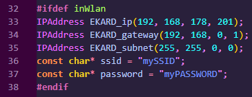

# Dokumentation des EKARD Version IV Server
Der EKARD_Server Quellcode ist für einen ESP32 Wroom in der Programmierumgebung Arduino IDE oder PlatformIO in VS Code konzipiert worden und verwendet spezielle Arduino-Bibliotheken. Es gibt zwei vorgefertigte Modi, um den EKARD_Server zu betreiben. Die erste Möglichkeit ist, den ESP32 als AccessPoint (im folgenden AP) zu nutzen. In diesem Betriebsmodus erstellt der ESP32 ein eigenes Netzwerk (Einwahldaten siehe Sourcecode: EKARD_ssid (Standard: EKARD_the_IV), EKARD_pass (Standard: 123456789)) und man muss sich mit dem Client-Gerät in dieses WLAN-Netz einwählen, um eine Verbindung zum EKARD aufbauen zu können. Dies kann vorteilhaft sein, wenn gerade kein (privates) WLAN-Netzwerk zur Verfügung steht, in welches man sich nur durch SSID und Passwort einloggen kann. Der Nachteil dabei ist, dass der ESP32 dabei keine Verbindung zum Internet bereitstellt, sodass keine Internetverbindung mit dem Client-Gerät möglich ist, solange dieses sich im EKARD-Netzwerk befindet. Wird der ESP32 als AP betrieben, stellt er gleichzeitig auch das Standard-Gateway des Netzwerks dar und hat damit die IP: 192.168.4.1, es ist sicherzustellen, dass diese IP auch im Client-Sourcecode definiert ist. Um den AP-Betriebsmodus zu nutzen ist sicherzugehen, dass im Sourcecode _define #inWlan_ __auskommentiert__ ist. 
Das einkommentieren von _define #inWlan_ deaktiviert den AP-Betriebsmodus, der ESP32 wählt sich in ein bestehendes Netzwerk ein und ist in diesem als Gerät auffindbar. Dazu müssen im Sourcecode unter WifiSettings die Einwahldaten des bestehenden Netzwerkes sowie die IP des entsprechenden Standard-Gateway und die genutzte Subnetzmaske hinterlegt werden.  Außerdem ist zu beachten, dass es zu IP-Konflikten kommen kann, falls in dem Netzwerk die IP-Adresse 192.168.178.201 bereits fest vergeben ist (in einem privaten Netzwerk jedoch sehr unwahrscheinlich), in diesem Fall muss dem EKARD ebenfalls eine neu IP-Adresse zugewiesen werden. WICHTIG: Bei einem Wechsel des Betriebsmodus muss auch immer eine Änderung der im Client definierten IP-Adresse erfolgen. 

## EKARD_Server main
Die "main"-Funktion besteht im "Arduino Style" aus einer setup- und einer loop-Funktion. Erste wird dabei nur einmal zu Beginn des Programmablaufs ausgeführt, während die loop-Funktion danach in Endlosschleife ausgeführt wird.

### Globale Variablen
Wifi-Einstellungen:
- Port-Nummer, auf der eine Verbidung aufgebaut werden kann
- Wifi-Daten für AP-Betrieb
- Wifi-Daten für inWLAN-Betrieb

- EKARD Instanz _EKARD_ 
- Array mit Servo-Instanzen _Axis_
- Array mit Servo-Pins _AxisPins_
- _TCPStream_ Buffer
- Aktueller an den EKARD kommunizierter Befehl _command_
- Array für Servo-Positionswinkel der vergangenen Iteration

### setup
Im Setup wird zunächst je nach Betriebsmodus die Netzwerkeinstellungen vorgenommen und der EKARD-Server gestartet. Anschließend werden die im EEPROM des EKARD gespeicherten Daten in die globalen Variablen eingelesen. Darauf basierend werden dann zuletzt die Servomotoren des EKARD initialisiert und in ihre Ausgangsposition (HomePosition) gebracht.

#### WICHTIG
Wird der EKARD bzw. der im EKARD enthaltene ESP32 das erste Mal in Betrieb genommen, muss der Speicher des ESP32 mit den EKARD-Standardparametern initialisiert werden, damit der Client auf diese zugreifen kann. Dazu muss die Funktion *EKARD_OneTimeMemoryInit()* im Setup einkommentiert werden, diese allokiert und füllt einen Speicherbereich im persistenten EEPROM des ESP32, sodass die Werte auch nach einem Aus- und wieder Einschalten noch gepseichert sind. Es gilt zu beachten, dass diese Funktion auch bereits gespeicherte überschreibt, sie muss also unbedingt nach der ersten Initialisierung wieder auskommentiert werden. Falls jedoch ein Reset des EKARDs auf seine Standardparameter gewünscht ist, kann dies ebenfalls mithilfe von *EKARD_OneTimeMemoryInit()* herbeigeführt werden. 

### loop
Zu Anfang wird überprüft, ob ein Client am spezifizierten Port detektiert werden kann, ist dies der Fall, wird versucht, eine Verbindung aufzubauen. Nach erfolgreichem Verbindungsaufbau wird eine Kommunikationsschleife mit dem verbundenen Client gestartet, bis die Verbindung beendet wird oder abreißt, in diesem Fall wird erneut begonnen, eine Client Detektion am spezifizierten Port durchzuführen. 
Innerhalb der Kommunikationsschleife erfolgt eine Abfrage, ob Daten vom Client verfügbar sind. Diese werden in den _TCPStream_-Buffer eingelesen und der Dateneingang mit einer Antwort bestätigt, falls die korrekten Paritätsbytes detektiert werden konnten. Abhängig vom empfangenen Befehl werden die entsprechenden EKARD-Funtionen aufgerufen und die Befehle vom Server ausgeführt. Falls eine korrekten Paritätsbytes festgestellt werden konnten, wird dies dem Client ebenfalls mitgeteilt.

## EKARD_Server Header File
Der EKARD_Server Header enthält:
- die Definitionen der Pin-Nummern für die Servo- und Hall-Sensor-Anschlüsse
- Definition der Anzahl der Zwischenschritte (StepCount), die ein Servo beim Anfahren seiner Position macht
- Definition der Port-Nummer (EKARD_Port), an der eine Verbindung hergestellt werden kann
- Definition Anzahl der Servos des EKARD (ServoNum)
- Definition der Grenz-Pulsweiten der Servos (Min_/Max_Servo)
- Definition der Kommunikationsstream Parameter
- Definition der genutzten EEPROM-Speichergröße
- define für Betriebsmodusumstellung (inWlan)

- Servo-Struct: Pendant zur Servo Klasse des Clients (nur Attribute)
- EKARD-Struct: Pendant zur EKARD_Client Klasse (nur Attribute, die für die Steuerung des EKARD Roboters relevant sind)
- enum Commands: Befehle zur Kommunikationssteuerung

## EKARD_Server Source File

### EKARD_MoveAxes()
Stellt die einzelnen Achsen des EKARD auf den aktuellen Wert aus dem EKARD_-struct ein.
Dazu wird zunächst die Differenz ziwschen alter und neuer Position kalkuliert und darauf basierend die Größe der einzelnen Zwischenschritte. Die Anzahl der Zwischenschritte wird durch *Axes_Speed* definiert, wobei jeder Zwischenschritt fünf Millisekunden dauert. Die Zeit einer EKARD-Bewegung berechnet sich also zu *Axes_Speed * 5ms*, die Schritteweite zu *PosDiffs / Axes_Speed*. 
Zum Einstellen der Achse 0 kann nicht direkt ein Winkel eingestellt werden, daher wird der Winkel durch eine Drehung mit bestimmter Geschwindkeit für eine bestimmte Zeit erreicht (eine Winkeleingabe über den *Servo.write(Winkel)*-Befehl von 90° entspricht bei richtiger Einstellung von min/maxPulse dabei einem Stillstand des Servos, eine Eingabe <90 lässt den Servo in die eine Richtung drehen, ein Wert >90 in die andere. Je weiter der Wert von 90 abweicht, desto schneller dreht der Servo dabei). Dazu wird ebenfalls zuerst die Positionsdifferenz bestimmt, das Vorzeichen der Differenz gibt dabei die Drehrichtung der Achse an.

### EKARD_SetPulseValues()
Initialisiert die Servos 1-5 neu mit den eingestellten Werten für min/maxPulse aus dem EKARD_-struct.

### EKARD_ProcessReceivedData()
Überprüft, ob die empfangenen Daten valide sind. Ist dies der Fall, werden je nach empfangenem Befehl die entsprechenden EKARD-Funktionen aufgerufen oder Variablen gesetzt.

### EKARD_CalibrateAxis0()
Kalibriert die min/maxPulse-Werte für den Servo0 sowie sowie die Zeit, die der Servo für eine Drehung von einem Grad benötigt. 
Zur Kalibrierung wird der Hall-Sensor genutzt. Im Sockel des EKARD ist ein Magnet eingelassen, sodass der Hall-Sensor ein LOW Signal ausgibt, wenn er sich direkt über dem Magneten befindet (Wichtig: es ist sicherzustellen, dass sich weder Magnet noch Sensor verschoben haben. Der Sensor weißt keine besonders hohe Genauigkeit auf und die Performance der einzelnen Exemplare kann sich unterscheiden. Kalibrierungsprobleme oder Ungenauigkeiten können auch (neben der Variablen Einstellung) auf einen ungünstig sitzenden Sensor zurückzuführen sein, es kann also hilfreich sein, den Sensorkopf durch Biegen der Drähte in eine etwas andere Position zu bringen).
Beim Kalibrieren wird zunächst die Zeitspanne von einem LOW-Signal zum nächsten gemessen (theoretisch 360°) bei einer Linksrotation mit fester Geschwindigkeitseinstellung (fester negativer Differenz zu 90 (definiert durch *EKARD.Axis_0Speed*)). Danach wird das gleiche Prozedere für eine Rechtsrotation durchgeführt. Im Idealfall (wenn min/maxPulse gut eingestellt sind) sollten beide gemessenen Zeitspannen gleich groß sein, sodass bei gleicher Rotationszeit der Betrag der Winkeländerung für eine Linksrotation und eine Rechtsrotation gleich groß sind. Wie sehr die gemessenen Rotationszeiten (für 360°) voneinander abweichen dürfen, wird durch *EKARD_.MaxTimeDiff* festgelegt, dieser Wert beschreibt die maximale Differenz der beiden Rotationszeiten. Vergrößert man diesen Wert, beschleunigt man den Kalibrierungsprozess, die Kalibrierung verliert jedoch an Genauigkeit, ein Verrringern dieses Parameters führt entsprechend zum Gegenteil. Ist die Zeitdifferenz größer als maximal zulässig, wird für den nächsten Kalibrierungsversuch der min/maxPulse-Wert von Servo 0 angepasst. Mit welcher Schrittweite diese Anpassung geschieht, wird durch den *EKARD_.CalibrationFactor* Parameter festgelegt. Wird dieser Wert verringert, beschleunigt das ebenfalls die Kalibrierung, kann jedoch bei einem zu großen Wert zu einem Deadlock in der Kalibrierung führen. Ein Vergrößern des Wertes führt zu kleinerer Kalibrierungsschrittweite, wodurch der Kalibrierungsprozess länger dauert, dafür aber zuverlässig ein Ergebnis liefert. Je nach gewünschter Genauigkeit, gilt es eine gute Kombination aus *EKARD_.MaxTimeDiff* und *EKARD_.CalibrationFactor* zu finden.
Wurde die Kalibrierung erfolgreich abgeschlossen, werden die min/maxPulse-Werte übernommen und die Zeitspanne für eine Ein-Grad-Drehung abgespeichert.   

### EKARD_ReadDataFromMemory
Liest die im EKARD-EEPROM gespeicherten Werte in die EKARD_-struct ein. Im EEPROM können mithilfe der EEPROM.h nur in Byte-Format abgelegt werden, daher werden Variablen die größer als ein Byte sind zum Abspeichern zerlegt und zum Auslesen wieder zusammengefügt.

### EKARD_SaveDataToMemory()
Speichert je nach vom Client empfangenem Befehl einen spezifischen Teil der aktuellen Werte des EKARD_-struct im EEPROM ab.

### EKARD_AutoHome()
Bewegt die EKARD-Achsen in die Position, die als HomePosition (Ausgangsposition) festgelegt wurde (standardmäßig die Senkrechte Position).

### EKARD_SendEKARDData(WifiClient *client)
Verpackt alle im EEPROM des ESP32 gespeicherten Daten in einen Buffer, sendet diesen an den Client und wartet auf eine Bestätigung. 

### EKARD_Demo0/1/2
Noch nicht vollständig implementiert.
Hier können Abfolgen von Positionen abgespeichert werden, an denen die Bewegungsmöglichkeiten demonstriert werden können. Es sind drei verschiedene Funktionen für verschiedene Bewegungsabläufe verfügbar, diese können über den Client abgerufen werden.

### EKARD_OneTimeMemoryInit()
(Über-)Schreibt den genutzten Speicherbereich im EEPROM mit den Standardwerten für den EKARD.